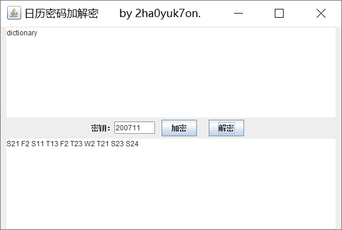

# CalendarCryptoTool
日历密码加解密工具

### 开发环境

java version "1.8.0_111"

### 工具介绍

明文：小写英文字母

密文：日历密码的密文格式，中间用空格分隔

密钥：某年某月，格式为`yyyyMM`

### 使用示例

密文：`S21 F2 S11 T13 F2 T23 W2 T21 S23 S24`

密钥：`200711`

